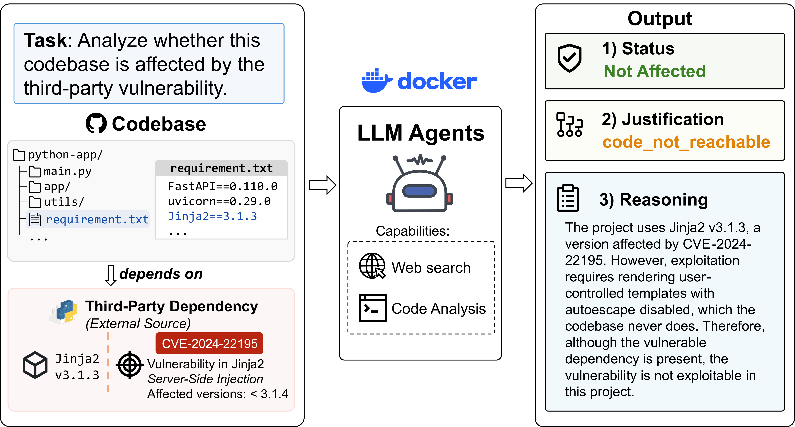

<div align="center">

# VEX-Bench

[](https://arxiv.org/abs/2609.08040)
[](https://2026.emnlp.org/)

</div>

> **Note:** This repository is still under construction — expect rough edges.

## News

- **2026-09-09** — Submission snapshot for the EMNLP 2026 paper.

## Introduction

VEX-Bench evaluates whether coding agents can determine if a dependency
vulnerability is actually exploitable in a real software project. A task pairs
a repository snapshot with a CVE. The agent must retrieve the relevant public
vulnerability information, inspect the source tree, trace the affected code
path, identify applicable mitigations, and return an evidence-backed verdict.

Package presence alone is not enough: an affected dependency may be unused,
unreachable, disabled by configuration, or protected by controls in the
application. VEX-Bench therefore measures repository-level vulnerability
exploitability assessment rather than dependency-version matching.

<p align="center">
  
</p>

## Task formulation

The benchmark file is [`benchmark/tasks/vex_bench.jsonl`](benchmark/tasks/vex_bench.jsonl),
with one JSON object per line:

```json
{
  "task_id": "...",
  "repo_url": "https://github.com/.../...",
  "commit_sha": "...",
  "cve_id": "CVE-...",
  "ground_truth": "exploitable | not_exploitable",
  "ground_truth_category": "...",
  "metadata": {"language": "go | java | python"}
}
```

| Field | Meaning |
|---|---|
| `task_id` | Unique task identifier |
| `repo_url` | GitHub URL of the target repository |
| `commit_sha` | Commit the agent checks out and inspects |
| `cve_id` | CVE under investigation |
| `ground_truth` | Binary label: `exploitable` or `not_exploitable` |
| `ground_truth_category` | Fine-grained reason for the binary label (see below) |
| `metadata.language` | `go`, `java`, or `python` |
| `metadata.pr_url` | Reference fix/discussion PR for the CVE in this repository |

The input of agents are only the CVE identifier and the checked-out source tree. It must output a JSON object containing one category and its reasoning:

```json
{"category": "...", "reasoning": "..."}
```

`category` is one of 12 fine-grained labels evaluated in strict precedence
order (e.g. `code_not_present`, `code_not_reachable`, `requires_configuration`,
`requires_environment`, `perimeter_protected`, `uncertain`, `vulnerable`, ...).
Exactly one category, `vulnerable`, maps to the binary label `exploitable`;
every other category maps to `not_exploitable`. The full category list,
precedence rules, and mapping logic live in
[`src/evaluate/prompts.py`](src/evaluate/prompts.py) and
[`src/evaluate/result_parser.py`](src/evaluate/result_parser.py).

## Quick start

### Setup

1. **Install the Python environment**

    We use [uv](https://docs.astral.sh/uv/) to manage the Python dependencies. Please install it at first.

   ```bash
   uv sync
   uv run vex-bench --help
   ```

2. **Download the pinned repository snapshots**

    This step downloads the targeted source code for analysis.

   ```bash
   uv run vex-bench download
   ```

3. **Build the sandbox images** — one per language, plus one per
   language-agent combination. Make sure Docker has enough disk space for
   all nine images:

   ```bash
   ./docker/build.sh
   ```

   Pass a language (and optionally an agent) to build only a subset, e.g.
   `./docker/build.sh go` or `./docker/build.sh python codex`. The agent
   CLIs are installed inside these images, not on the host.

4. **Configure the agent(s) you intend to run** by copying the templates
   under `env/<agent>/` to their non-`.example` names and filling in your
   provider's API credentials. Real credential files are ignored by Git; do
   not commit them. Running experiments also needs outbound network access
   to the model API and to public vulnerability sources the agent
   researches.

See the [CLI reference](#cli-reference) for every option these commands
accept, and [Repository layout](#repository-layout) for where each piece of
setup lives on disk.

### Experiment flow

Once setup is done, running an experiment is three commands, each a separate
stage so a long run can be resumed and so parsing/scoring can be redone
without re-invoking paid model APIs:

1. **Run** — an agent investigates one CVE per task inside its sandbox
   container and writes its raw output.
2. **Parse** — each raw output is turned into a structured category and
   reasoning.
3. **Metrics** — parsed predictions are scored against the ground-truth
   labels.

The same `--agent`, `--model`, `--prompt`, `--benchmark`, and `--repeats`
flags must be passed to all three stages, since they identify which
experiment's files each stage reads and writes.

> Running the benchmark invokes paid model APIs. Start with one repeat and
> low parallelism, confirm the generated outputs, and estimate cost before
> scaling up. Per-run timeouts stop the local container but do not guarantee
> that a provider will not bill an already submitted request.

### Running an experiment

```bash
uv run vex-bench evaluate run \
  --agent codex \
  --model gpt-5.5 \
  --repeats 1 \
  --parallel 1

uv run vex-bench evaluate parse \
  --agent codex \
  --model gpt-5.5 \
  --repeats 1

uv run vex-bench evaluate metrics \
  --agent codex \
  --model gpt-5.5 \
  --repeats 1
```

`run` caches valid completed outputs, so an interrupted experiment can be
resumed with the same command. See the [CLI reference](#cli-reference) below
for the full flag list shared by all three stages.

## CLI reference

```text
vex-bench download [TASKS.jsonl]
vex-bench evaluate run
vex-bench evaluate parse
vex-bench evaluate metrics
```

Common evaluation options:

| Option | Default | Meaning |
|---|---|---|
| `--agent` | `opencode` | `codex`, `claude`, or `opencode` |
| `--benchmark` | `vex_bench` | Registered benchmark name |
| `--model` | `kimi-k2.6` | Model/deployment identifier for the selected agent |
| `--prompt` | `vuln` | Prompt template registered in `src/evaluate/prompts.py` |
| `--repeats` | `1` | Independent runs per task |
| `--timeout` | `600` | Agent timeout per task, in seconds |
| `--parallel` | `1` | Concurrent containers during the run stage |
| `--repos-dir` | `benchmark/repos` | Downloaded repository root |
| `--output-dir` | `results` | Experiment output root |

Run `uv run vex-bench <command> --help` for command-specific details. OpenCode
model aliases are registered in `src/evaluate/agents/opencode.py`; Codex and
Claude model names must match the corresponding provider configuration or
deployment. `--output-dir` controls where the files described in
[Outputs and metrics](#outputs-and-metrics) below are written.

## Outputs and metrics

Results are namespaced by a 12-character hash of the prompt template:

```text
results/<prompt_hash>/<agent>/<model>/
├── <task_id>/run_001/
│   ├── result.json or result.jsonl
│   ├── error.txt                 # present only after a failed run
│   └── artifacts/                # agent-specific diagnostics, when available
└── vex_bench/
    ├── parsed.jsonl
    └── metrics.json
```

The metrics stage reports:

- binary accuracy, precision, recall, F1, and confusion counts;
- multiclass macro/weighted and per-category metrics;
- completion rate and failure status counts;
- normalized token usage; and
- per-case and total estimated USD cost when the model is listed in
  [`src/evaluate/pricing.py`](src/evaluate/pricing.py).

Unparseable or missing agent answers count as failures rather than being
silently excluded from accuracy. Unknown model prices are reported as
unpriced, not as zero cost.

## Reproducibility notes

- Task repositories are checked out at exact commit SHAs and `.git` history is
  removed after download.
- Agent CLI versions and language runtimes are pinned in the Dockerfiles.
- Source trees are copied into disposable containers, so agent writes do not
  mutate the downloaded benchmark snapshot.
- The prompt template is stored once under its hash in the output directory.
- Exact model availability and responses remain provider-dependent; record the
  deployment/model revision and run date when reporting new results.
- The benchmark contains public vulnerability metadata and ground-truth labels.
  Keep evaluation agents confined to the supplied source snapshot to avoid
  accidental label leakage from local files.

## Repository layout

```text
vex-bench/
├── benchmark/
│   └── tasks/          Benchmark task definitions and labels
├── docker/             Language base images and agent-specific images
├── env/                Credential/configuration templates (secrets are ignored)
└── src/
    ├── builder/        Pinned-repository downloader
    ├── evaluate/       Run, parse, and metrics pipeline
    │   └── agents/     Codex, Claude Code, and OpenCode adapters
    └── utils/          Shared helpers (repo checkout, shell exec)
```

Downloaded repositories (`benchmark/repos/`) and experiment outputs
(`results/`) are intentionally not tracked.

## Citation

If you found VEX-Bench useful, please cite our paper.

```
@misc{shi2026vexbenchbenchmarkingllmagents,
      title={VEX-Bench: Benchmarking LLM Agents for Assessing Exploitability of Software Supply Chain Vulnerabilities}, 
      author={Jiahao Shi and Edward Tsien and Yifeng Di and Hongjiao Zhang and Yuan Tang and Ronit Dey and Ilona Shishov and Gal Netanel and Zvi Grinberg and Vladimir Belousov and Bat-Zion Rotman and Ilan Pinto and Tianyi Zhang},
      year={2026},
      eprint={2609.08040},
      archivePrefix={arXiv},
      primaryClass={cs.CR},
      url={https://arxiv.org/abs/2609.08040}, 
}
```